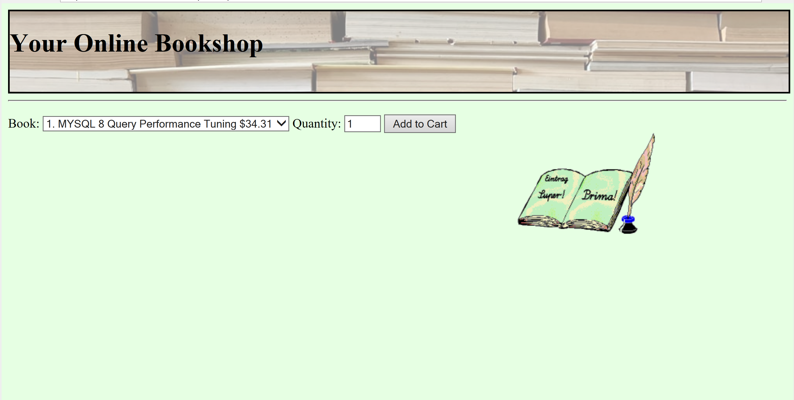
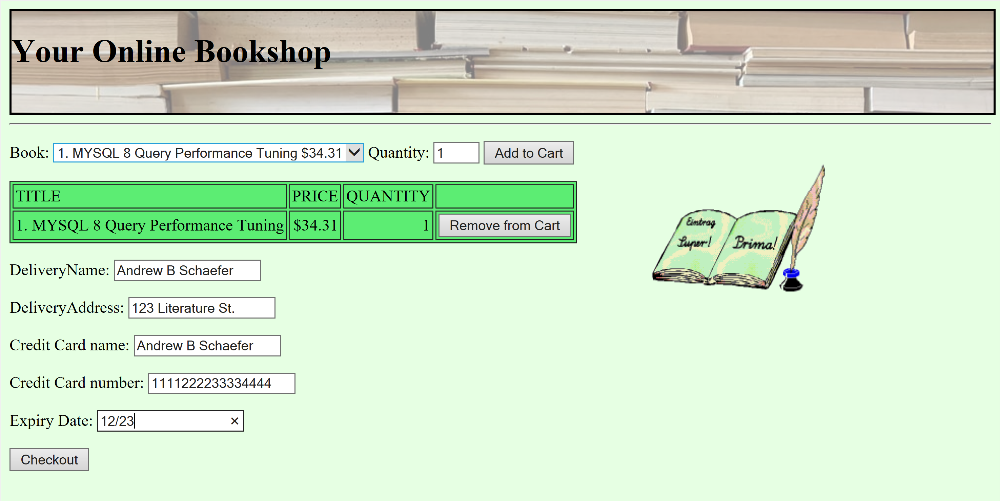
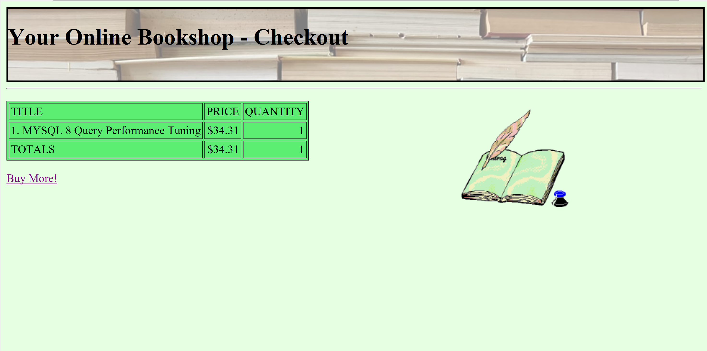

## eBookShop

## Table of Contents
1. [Functionality Screen Shots](#functionality-screen-shots)
2. [Application Description](#application-description)
3. [Technologies Used](#technologies-used)
4. [Developer Information](#developer-information)

##Functionality Screen Shots

Book Inventory stored in database ->                   |  Cart and Customer Checkout Form ->               |  Purchase Summary
:-------------------------:|:-------------------------:|:-------------------------:
  |   | 

[Back to Table of Contents](#table-of-contents)

### Application Description

This is a simple, but fully functioning web-based application that used advanced Java/JSP, HTML, CSS, JavaScript, and SQL concepts to create a mock book e-commerce website. The application allows users to view the eBookShop's book inventory which is stored in a MySQL database, choose their desired books, and make a dummy purchase. Users also have the ability to remove items from their car and once the form is submitted, a summary of the books chosen as well as the total price for the entire purchase is displayed. The application also features the use of servlets, Tomcat, JDBC for database concerns, responsive front-end design, and the MVC architecture.

[Back to Table of Contents](#table-of-contents)

### Technologies Used

- Java/Java Sever Pages
- HTML
- CSS
- JavaScript
- SQL scripts
- XML
- Tomcat Server for local hosting
- MySQL
- Eclipse IDE
- MVC architecture

[Back to Table of Contents](#table-of-contents)

## Developer Information
Designed and built by Andrew B. Schaefer [(Ab0213ab)](https://github.com/Ab0213ab) with inspiration from the E-BookShop assignment from *Beginning Jakarta EE Web Development* by Luciano Manelli and Giulio Zambon.

LinkedIn: https://www.linkedin.com/in/andrewbschaefer/

Email: Abs233abs@gmail.com 

[Back to Table of Contents](#table-of-contents)
